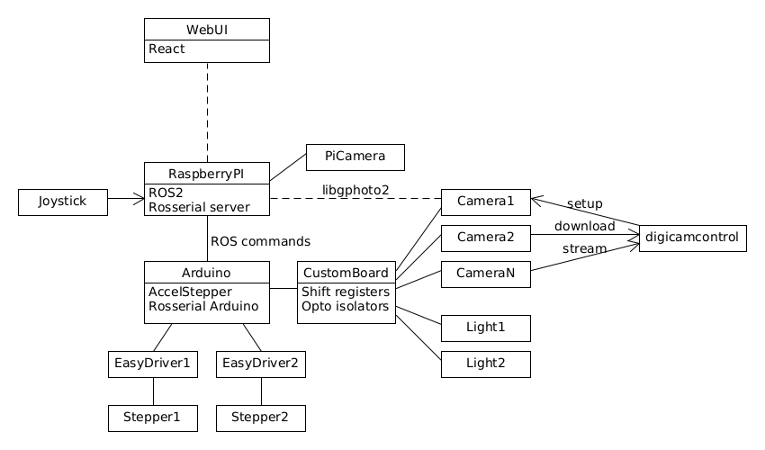

# StepIt

[](https://github.com/kineticsystem/stepit/actions/workflows/industrial_ci_action.yml)

A project to control stepper motors and professional cameras for 3D macro photography.



## Prerequisites

We need a machine running Ubuntu 22.04 with ROS 2 Humble installed.

To install ROS 2, please refer to the document [Install ROS2 Humble on Ubuntu](https://docs.ros.org/en/humble/Installation/Ubuntu-Install-Debians.html)

## StepIt Installation

Open a terminal and run the following command to source the ROS 2 Humble installation.

`source /opt/ros/humble/setup.bash`

Create a project folder anywhere inside the home directory, for example

`<HOME_DIR>/stepit_ws`

Through the document, we will use `<STEPIT_WS>` to refer to this folder.

```
cd ~
mkdir stepit_ws
cd stepit_ws
```

Create a source folder and check out this git repository.

```
mkdir src
cd src
git clone git@github.com:kineticsystem/stepit.git
```

Check out the external dependencies.

```
sudo apt install python3-vcstool
vcs import --force < stepit/stepit.repos
vcs pull
```

Move into the base `<STEPIT_WS>` folder and install all required dependencies.

```
rosdep install --ignore-src --from-paths . -y
```

Run Colcon to build the project.

```
cd ..
sudo apt install python3-colcon-common-extensions
colcon build --cmake-args -DCMAKE_BUILD_TYPE=Debug --symlink-install --event-handlers log-
```

Execute all tests.

```
colcon test
```

## How to run GitHub actions locally

At each commit, the GitHub repository runs all available tests using [GitHub actions](https://docs.github.com/en/actions) and [Industrial CI](https://github.com/ros-industrial/industrial_ci).

A GitHub action fires up a docker container with Ubuntu 22.04 and ROS2 Humble, checks out and builds the code inside the docker container and runs all tests.

Sometimes, it may be desirable to execute the Continuous Integration pipeline locally. This is possible by using [Nektos](https://github.com/nektos/act).

First of all, we must create a GitHub token to access the repository. Then, we
must install Nektos `act` command in the user folder `~/bin` as explained in Nektos README.md file. We need an `.env` file at the root of the repository to define a few global variables required by Industrial CI. Finally, we can run the following command from the same folder:

`~/bin/act pull_request --workflows ./.github/workflows/industrial_ci_action.yml -s GITHUB_TOKEN`

## Configuration

For Arduino IDE (or Visual Studio Code) to find the included libraries, modify the variable the `sketchbook.path` in the following configuration file:
`<USER_HOME>/snap/arduino/61/.arduino15/preferences.txt`

## Running the application

By default, the application runs with fake motors. Run the following commands on a terminal to start it up. This will also start up RViz.

```
cd <STEPIT_WS>
source install/setup.bash
ros2 launch stepit_description bringup.launch.py
```

We can control the motors with a velocity controller or a position controller. Open a different terminal and run any of the following commands to spin up the fake motors.

```
cd <STEPIT_WS>
source install/setup.bash
```

To control the position run

```
ros2 topic pub -1 /position_controller/commands std_msgs/msg/Float64MultiArray "data: [0, 0]"
```

To control the velocity run

```
ros2 topic pub -1 /velocity_controller/commands std_msgs/msg/Float64MultiArray "data: [6,-6]"
```
