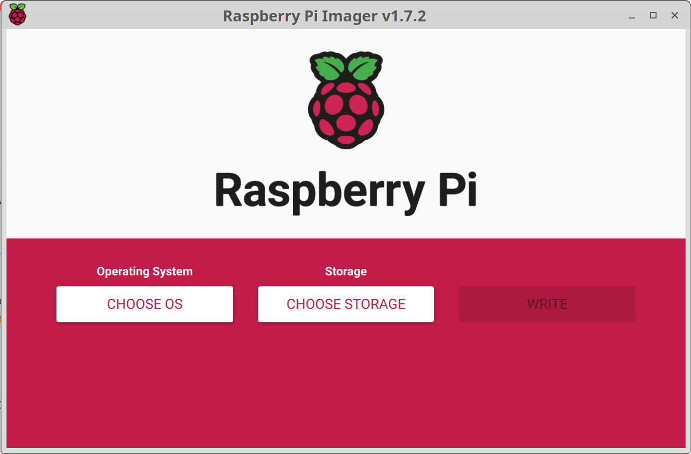
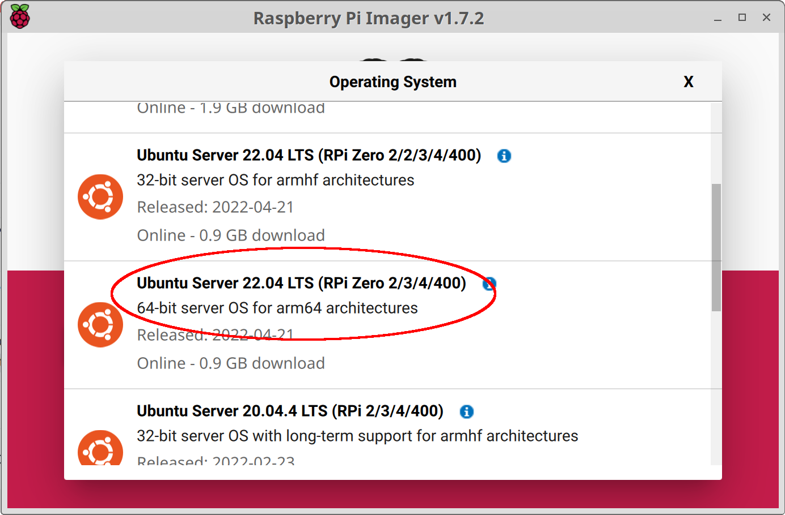
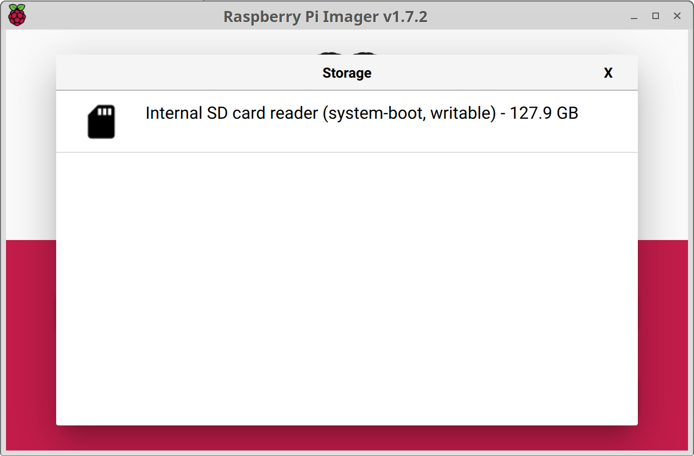
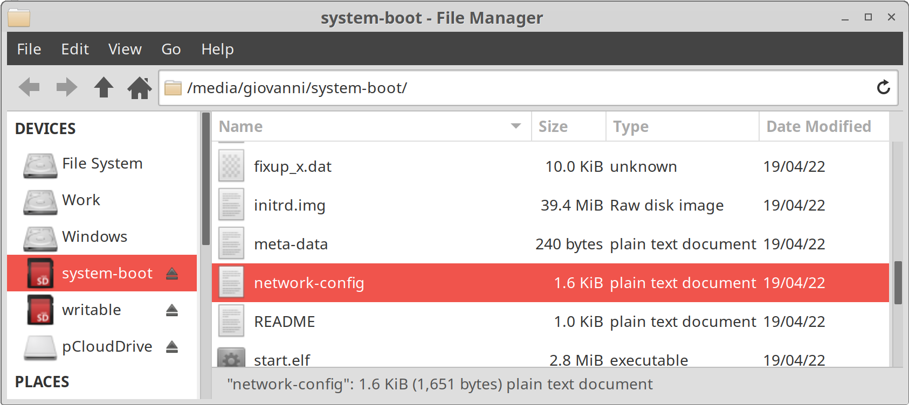

# How to install ROS2 on Rasperry Pi 4

## Prerequisites

A PC running Ubuntu Desktop 22.04LTS and an empty Micro SD card with a minimum 64GB of RAM.

## Write a Rasperry Pi image

On the Rasperry Pi we will install Ubuntu Mate Server 22.04 LTS. We do not need a desktop version of Ubuntu because we do not plan any user interface running on it.

The simplest way to write an image onto the SD card is using a software called `rpi-image`. To install the software, open a terminal and type the follwing command:

`sudo snap install rpi-imager`

The command `rpi-imager` will bring up the following screen.



Click the menu "Choose OS", then "Other general-purpose OS", "Ubuntu", and finally select the 64-bit architecture "Ubuntu Server 22.04 LTS (RPi Zero 2/3/4/400)"



Choose the empty SD card and then click the button "Write".



You will be asked for the root password to write the image onto the SD card.

## Configure WiFi connection

Before inserting the card into the Raspberry Pi we will configure the WiFi network connection. Mount the system-boot partition on the SD Card and search for the file `network-config`



```
version: 2
ethernets:
  eth0:
    dhcp4: true
    optional: true
#wifis:
#  wlan0:
#    dhcp4: true
#    optional: true
#    access-points:
#      myhomewifi:
#        password: "S3kr1t"
#      myworkwifi:
#        password: "correct battery horse staple"
#      workssid:
#        auth:
#          key-management: eap
#          method: peap
#          identity: "me@example.com"
#          password: "passw0rd"
#          ca-certificate: /etc/my_ca.pem
```

Uncomment the following lines and type you access point name and password. Following an example:

```
wifis:
  wlan0:
    dhcp4: true
    optional: true
    access-points:
      vodafone:
        password: "12345678"
```

If you want to use a static IP you can use the following code instead, substituting the correct IPs to the ones shown in the example.

```
wifis:
  wlan0:
    addresses:
    - 192.168.1.3/24
    gateway4: 192.168.1.1
    nameservers:
      addreses: [192.168.1.1, 8.8.8.8]
    optional: true
    access-points:
      vodafone:
        password: "12345678"
```

Now insert the SD card into the Rasperry Pi and power it up.

## Find the Rasperry Pi

If you started Rasperry Pi with a dynamic IP, you will need to find it first. To display the network address(es) of the host name type

`hostname -I`

This will ouput a list of IPs similar to the following one.

```
192.168.1.104 172.27.65.82 172.17.0.1 172.18.0.1 172.16.70.1 172.16.41.1
```

In our case, the host IP is 192.168.1.104 and the newtwork has an IP range in 192.168.1.0/24. Type the following command to scan the network:

`sudo nmap -sn 192.168.1.0/24`

This will ouput the following, showing the Rasperry Pi address 192.168.1.100.

```
Starting Nmap 7.80 ( https://nmap.org ) at 2022-05-23 16:56 CEST
Nmap scan report for 192.168.1.100
Host is up (0.0061s latency).
MAC Address: B8:27:EB:99:B0:B3 (Raspberry Pi Foundation)
Nmap scan report for 192.168.1.102
Host is up (0.030s latency).
MAC Address: 80:4E:81:51:CE:51 (Samsung Electronics)
Nmap scan report for 192.168.1.103
Host is up (0.23s latency).
MAC Address: FA:90:88:0A:32:71 (Unknown)
Nmap scan report for Kinetic (192.168.1.104)
Host is up.
Nmap done: 256 IP addresses (7 hosts up) scanned in 3.18 seconds
```

To check if the IP is correct type the following command:

`ping 192.168.1.100`

```
PING 192.168.1.100 (192.168.1.100) 56(84) bytes of data.
64 bytes from 192.168.1.100: icmp_seq=1 ttl=64 time=20.9 ms
64 bytes from 192.168.1.100: icmp_seq=2 ttl=64 time=7.67 ms
```

## Log into the Rasperry Pi

Open a terminal on the main computer and SSH into the Rasperry Pi using default user (ubuntu) and password (ubuntu). In our case the IP of the device is 192.168.1.100.

`ssh ubuntu@192.168.1.100`

At the first access you are required to change the password, log out and then login again. The first thing to do is upgrading all installed packages by typing the following commands.

`sudo apt update`

`sudo apt upgrade`

## Install ROS2

Because we are running Ubuntu Mate Server 22.04 LTS, we will install ROS2 Humble Hawksbill. For the details of the installation please refer to the following link:

[https://docs.ros.org/en/humble/Installation/Ubuntu-Install-Debians.html](https://docs.ros.org/en/humble/Installation/Ubuntu-Install-Debians.html)

On Ubuntu Mate Server 22.04 LTS, the commands to install ROS2 will be limited to the following.

Add ROS2 repository authorization keys.

`sudo apt update && sudo apt install curl gnupg lsb-release`

`sudo curl -sSL https://raw.githubusercontent.com/ros/rosdistro/master/ros.key -o /usr/share/keyrings/ros-archive-keyring.gpg`

Add ROS2 repository.

`echo "deb [arch=$(dpkg --print-architecture) signed-by=/usr/share/keyrings/ros-archive-keyring.gpg] http://packages.ros.org/ros2-testing/ubuntu $(source /etc/os-release && echo $UBUNTU_CODENAME) main" | sudo tee /etc/apt/sources.list.d/ros2.list > /dev/null`

Update and install ROS2 packages.

`sudo apt update`

`sudo apt install ros-humble-ros-base`

## Configuring ROS2 environment

To make ROS2 packages avaiable for development, type the following command:

`source /opt/ros/humble/setup.bash`

If you want to make them available at Rasperry Pi startup, you can add it to your `.bashrc` file:

`echo "source /opt/ros/humble/setup.bash" >> ~/.bashrc`

The following package will add autocompletion throughout ROS and it will be very useful to easily run ROS commands.

`sudo apt install python3-argcomplete`

To check if ROS is installed type

`ros2`
