# Motor kinematics

## Position control

In this section, we want to calculate the trajectory of a motor moving from a point $x_0$ to a point $x_1$. At each time $t > 0$, we want to know the motor axis position $x(t)$ measured in radians and the velocity $v(t)$ measured in radians per second.

In the following picture, we show a diagram displaying the velocity $v(t)$ of a motor moving forward from position $x_0$ to position $x_1$, with zero initial velocity and acceleration $a$. In a typical situation, the motor accelerates to a maximum velocity $v_{max}$, keeps the same velocity for a while and then decelerates until it reaches the position $x_1$.

The area $\Delta x$ under the curve represents the distance between $x_0$ and $x_1$.

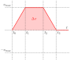

When

$$\Delta x = x_1 - x_0 \le \frac{v_{max}^2}{a}$$

the trajectory degenerates into a triangle.

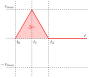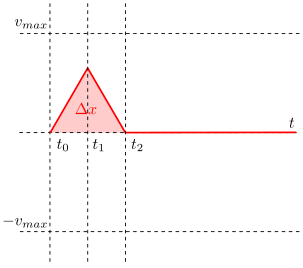

If $x_1< x_0$, $v(t)$ becomes negative as shown in the following diagrams.

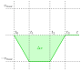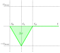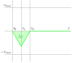

If the initial velocity $v_{max} \gt 0$, we have the following situation.

Without knowing the motor trajectory before time $t_0$, we can assume that it reached this point starting from a point $t_{-1}$ and accelerating until point $t_0$.

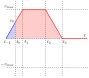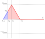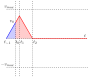

Knowing the acceleration $a$ and the initial velocity $v_0$, it is easy to calculate $t_0 - t_{-1}$.

$$\Delta t = t_0 - t_{-1} = \frac{v_0}{a}$$

We already know the trajectory $v(t)$. To account for the initial velocity $v_0$ we can simply translate $v(t)$ to obtain the new trajectory

$$v'(t) = v\left(t + \frac{v_0}{a}\right)$$

If a motor has velocity $v_0$ at time $t_0$, it may be necessary for the motor to decelerate, stop and change direction to reach the position $x_1$. This leads to a combined trajectory as shown in the following diagrams.

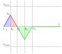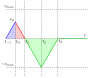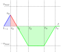

The time and the distance required for a motor to stop are the following.

$$
\begin{align*}t_{stop} = \frac{v_0}{a} && x_{stop} = \frac{v_0^2}{2a}\end{align*}
$$

If $\Delta x \ge x_{stop}$, the motor does not reverse and keeps its course. If $\Delta x < x_{stop}$, the motor must stop and change direction to reach the target point $x_1$.
If the motor reverses, we can break the trajectory into two parts.

$$
v''(t) =
\begin{cases}
v_0 - at & t < t_{stop}\\
v(t - t_{stop}) & t >= t_{stop}
\end{cases}
$$
