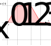
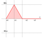
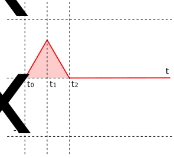
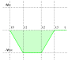
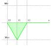
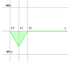

# Motor kinematics simulation

## Position control

In the following picture, we show a diagram representing the velocity of a motor moving forward from position $x_0$ to position $x_1$, with zero initial velocity $v_0$ at time $t_0$ and acceleration $a$. In a typical situation, the motor accelerates to a maximum velocity $v_{max}$, keeps the same velocity for a while and then decelerates until it reaches the position $x_1$.

The area $\Delta x$ under this curve represents the distance between $x_0$ and $x_1$.

If $x_1$ is not too far from $x_0$, the velocity trajectory may degenerate into the following curve. The area of the triangle is

$$\Delta x = \frac{v_{max}^2}{a}$$

If the distance between $x_0$ and $x_1$ is shorter than this quantity, the trajectory degenerates even more into the following curve.

If $x_1<x_0$, the above diagrams become

