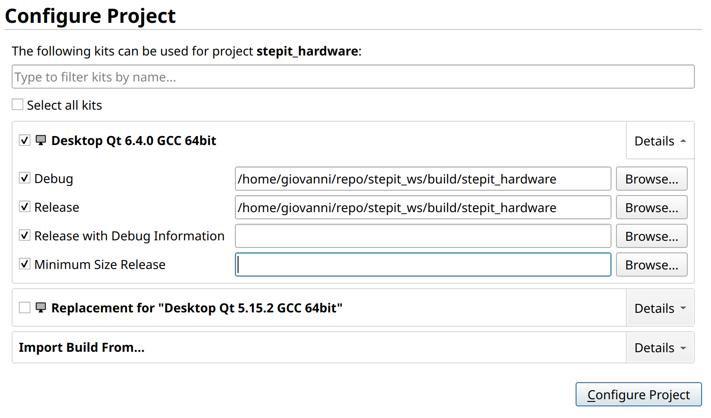

# StepIt and QtCreator

## How to configure QtCreator to develop StepIt

QtCreator is an excellent tool for developing C++ applications, and we can use it to develop and build StepIt on top of ROS 2.

In this document, we assume that the GitHub repository of StepIt is checked out in a local folder that we call `<STEPIT_WS>`

## Build Moveit Studio in Debug mode

Before using QtCreator, we must build the application with Colcon from the command line. To build the application in debug mode, open a terminal inside the root folder `<STEPIT_WS>` (where the README.md file is) and run the following command.

```
colcon build --cmake-args -DCMAKE_BUILD_TYPE=Debug --symlink-install --event-handlers log-
```

## Build StepIt and choose QtCreator

For a better experience, we should download and install the latest QtCreator 6. Once installed, remember to launch QtCreator 6 from the command line by executing the shell script `qtcreator.sh` and not `qtcreator`. The shell script is preferable because it configures the environment variable LD_LIBRARY_PATH to avoid conflicts with the system Qt libraries.

## Source StepIt

Before running QtCreator, always run the following command from the terminal to instruct the IDE where all project libraries are located, including ROS 2 libraries, and the position of the build folder.

```
source $STEPIT_WS/install/setup.bash
```

Failure to do so will most likely cause issues with the CMAKE_PREFIX_PATH environment variable, which CMake uses to find all required packages. For example, we may experience linking issues while building the application inside the IDE.

## Project configuration

When in QtCreator, open a project `CMakeList.txt`. When prompted to configure it, in both Release and Debug profiles, specify the build directory generated by Colcon.

In the following example, we open the `CMakeList.txt` inside the project `stepit_hardware`, so we must select the corresponding subdirectory inside the build folder.

**Note:** Be sure to select the build and not the install folder.



## Building the project


Please note that the working directory must be the root of the project <STEPIT_WS>, where the README.md file is. If we choose a different directory, we will not be able to build the code inside QtCreator.

## Code formatting

In Qt Creator it is possible to configure a default code formatter based on ClangFormat.


First of all, you must enable the plugin "Beautifier" by selecting the menu

_Help → About Plugins..._

Restart QtCreator and configure the plugin by selecting the menu

_Tools → Options → Beautifier_

On the General tab enable _Automatic Formatting_ on File Save and choose ClangFormat from the Tools dropdown.


On the Clang Format tab, from the _Use Predefined style_ choose the option _File_.


When you start QtCreator, it will read Clang Format style from the file `.clang-format` at the root of the src folder.
