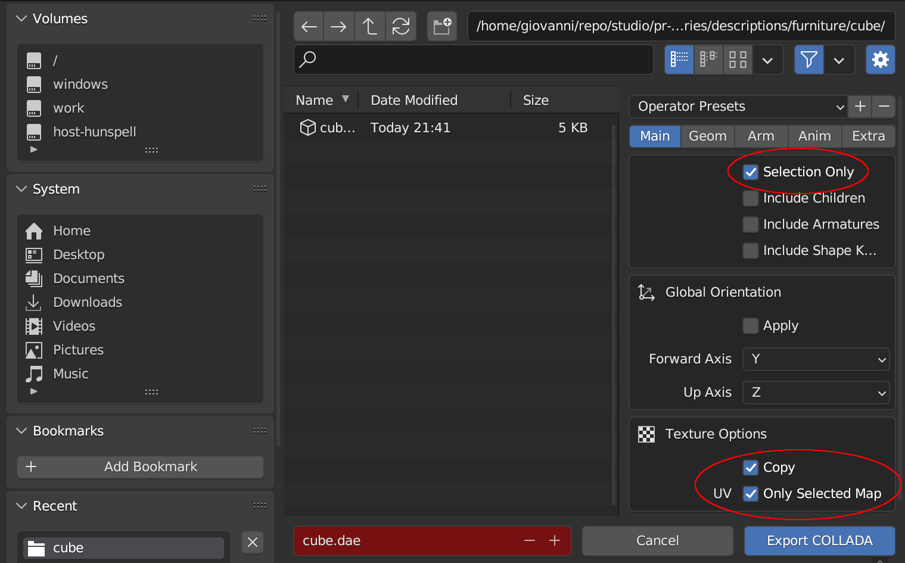

# Meshes with textures in RVIZ

## Blender and Collada (DAE) files

It is possible to use Blender to create meshes, texture them and export them into Collada (DAE) files so they can be visualized in RVIZ.

The plugin to export Collada (DAE) files from Blender can be a little bit tricky. In order to export the texture, we must edit the mesh UV map and we must specially create the material.

For the material, we must use four nodes:

1. a Texture Coordinate node;
2. a Texture node;
3. a principled BSDF node;
4. a Material Output node.

The Texture Coordinate node "UV" output must be connected to the Texture node "Vector" input.

The Texture node "Color" output must be connected to the Principled BSDF node "Base Color" input.

The Principled BSDF node "BSDF" output must be connected to the Material Output node "Surface" input.

For all this to work, the object must provide UV coordinates.

When we export the object in DAE format, we must remember to check the options:

- Main - Selection only
- Texture Options - Copy
- Texture Options - Only Selected Map

The texture will be exported in the same location as the DAE file. For RVIZ to find it, it must remain in the same position, together with the DAE file and not in the texture as required by Gazebo.
