# Motor kinematics

## Position control

In this section, we want to calculate the trajectory of a motor moving from a position $x_0$ to a position $x_1$. At each time $t > 0$, we want to know the motor position $x$ in radians and the velocity $v$ in radians per second.

Both trajectories depend on the motor acceleration $a$, the maximum velocity $v_{max}$, the initial velocity $v_0$, the initial position $x_0$ and the final position $x_1$.

$$v = v(v_{max}, a, v_0, x_0, x_1, t)$$

$$x = x(v_{max}, a, v_0, x_0, x_1, t)$$

The following picture shows the velocity of a motor moving forward from position $x_0$ to position $x_1$, with zero initial velocity. In a typical situation, the motor accelerates to a maximum velocity $v_{max}$, keeps the same velocity for a while, and then decelerates until it reaches position $x_1$.

The area $\Delta x$ under the curve represents the distance between $x_0$ and $x_1$ and can be positive or negative.

When

$$|\Delta x| = |x_1 - x_0| \le \frac{v_{max}^2}{a}$$

the trajectory degenerates into a triangle.

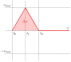

If $x_1< x_0$, $v$ becomes negative, as shown in the following diagrams.

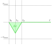

If $|v_{0}| \gt 0$, we have the following situation.

Without knowing the motor trajectory before time $t_0$, we can assume that it reached this point, starting from point $t_{-1}$ and then accelerating until point $t_0$.

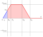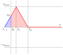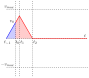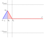

Knowing the acceleration $a$ and the initial velocity $v_0$, we can calculate the two quantities $t_{stop}$ and $x_{stop}$, the first equivalent to the time required by a motor at initial velocity $v_0$ to stop and the second representing the required distance

$$
\begin{align*}t_{stop} = t_0 - t_{-1} = \bigg| \frac{v_0}{a} \bigg| && x_{stop} = \frac{v_0^2}{2a}\end{align*}
$$

We already know the trajectory $v$ at time $t$ with zero initial velocity. To account for the initial velocity $v_0$, we can calculate the velocity using the following formula.

$$v'(t) = v\left(v_{max}, a, 0, x_0, x_1 + x_{stop}, t + t_{stop}\right)$$

If a motor has a non-zero initial velocity at time $t_0$, it may be necessary for the motor to decelerate, stop and change direction to reach the position $x_1$. This leads to a combined trajectory, as shown in the following diagrams.

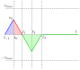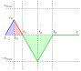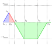

The distance to stop $x_{stop}$ is represented by the area in red, which is also equal to the area in blue.

If $|\Delta x| \ge x_{stop}$, the motor does not reverse. If $|\Delta x| \lt x_{stop}$, the motor must stop and change direction to reach the target point $x_1$.
If the motor reverses, we can calculate the velocity as follows.

$$
v''(t) =
\begin{cases}
v_0 - \text{sgn}(v_0) at & t < t_{stop}\\
v(v_{max}, a, 0, x_0, x_1 - x_{stop}, t - t_{stop}) & t \ge t_{stop}
\end{cases}
$$

## Velocity control

In this section, we want to calculate the trajectory of a motor changing velocity from $v_0$ to $v_1$ starting at position $x_0$. At each time $t > 0$, we want to know the motor position $x$ in radians and the velocity $v$ in radians per second.

Both trajectories depend on the motor acceleration $a$, the maximum velocity $v_{max}$, the initial and final velocities $v_0$ and $v_1$, and the initial position $x_0$.

$$v = v(v_{max}, a, x_0, v_0, v_1, t)$$

$$x = x(v_{max}, a, x_0, v_0, v_1, t)$$

The following diagrams show the velocity of a motor accelerating from position $x_0$ at zero velocity until reaching the cruise velocity $v_1$.

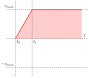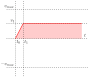

If $v_1$ is negative, we have the following diagrams instead.

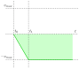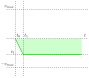

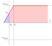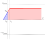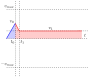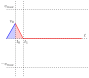

If a motor has a non-zero initial velocity at time $t_0$, it may be necessary for the motor to decelerate, stop and change direction to reach the new velocity $v_1$. This leads to a combined trajectory, as shown in the following diagrams.

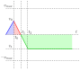

Again, we can use $t_{stop}$ to break the trajectory into two known formulas.

If

$$\text{sgn}(v_0) \neq \text{sgn}(v_1)$$

then

$$
v''(t) =
\begin{cases}
v_0 + \text{sgn}(v_1 - v_0) at & t < t_{stop}\\
v(v_{max}, a, 0, v_1, x_0, t - t_{stop}) & t \ge t_{stop}
\end{cases}
$$
