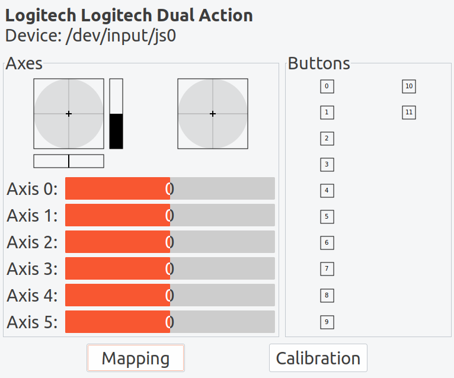

# StepIt Joystick driver

This package starts up a ROS node to manage a Joystick teleoperation.

## Configuration

One easy way to check if you joystick works with Ubuntu is to install the package jstest-gtk.

`sudo apt install jstest-gtk`

